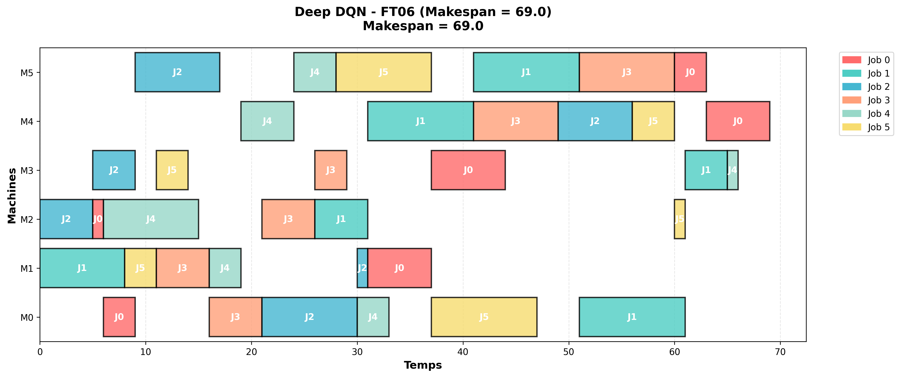
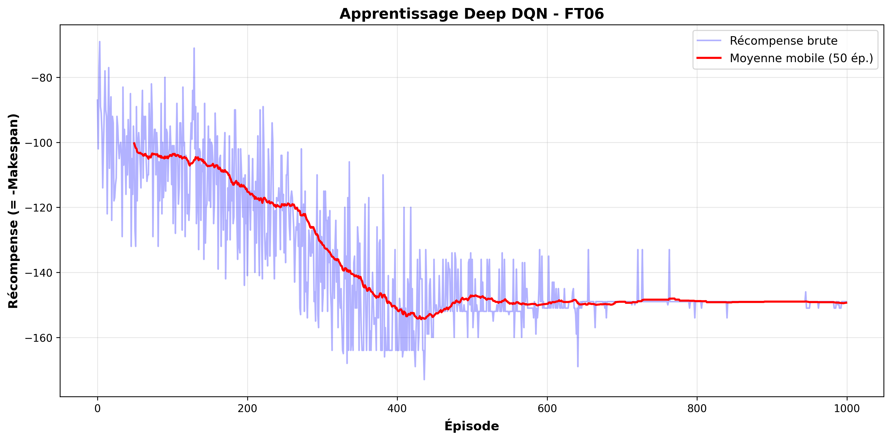
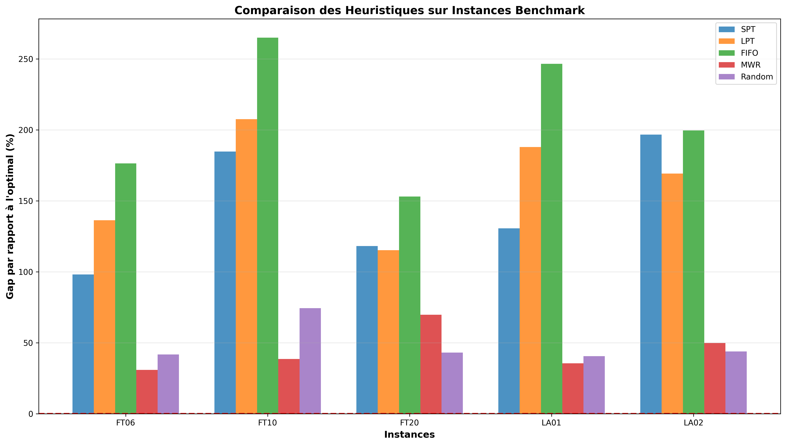

# 🏭 Job Shop Scheduling avec Deep Reinforcement Learning

[](https://www.python.org/)
[](https://pytorch.org/)
[](LICENSE)
[](https://github.com/VOTRE_USERNAME/job-shop-rl)

Implémentation complète d'algorithmes de **Deep Reinforcement Learning** pour résoudre le **Job Shop Scheduling Problem (JSSP)**, un problème classique d'optimisation combinatoire NP-difficile.



---

## 📋 Table des Matières

- [À Propos](#-à-propos)
- [Problème du Job Shop](#-problème-du-job-shop)
- [Agents Implémentés](#-agents-implémentés)
- [Architecture du Projet](#-architecture-du-projet)
- [Installation](#-installation)
- [Utilisation](#-utilisation)
- [Résultats Expérimentaux](#-résultats-expérimentaux)
- [Visualisations](#-visualisations)
- [Benchmarks](#-benchmarks)
- [Références](#-références)

---

## 🎯 À Propos

Ce projet explore l'application du **Deep Reinforcement Learning** pour résoudre le Job Shop Scheduling Problem. Il implémente et compare plusieurs approches :

- **Heuristiques classiques** (SPT, LPT, FIFO, etc.)
- **Q-Learning simple** (table-based)
- **Deep Q-Network (DQN)** avec PyTorch
- **Proximal Policy Optimization (PPO)**
- **Deep PPO** avec réseaux de neurones

### 🎓 Objectifs Pédagogiques

- Comprendre les fondamentaux du Reinforcement Learning
- Implémenter des algorithmes DRL de zéro
- Appliquer le Deep Learning à l'optimisation combinatoire
- Benchmarker sur instances classiques (FT06, FT10, LA01, LA02)

---

## 🏭 Problème du Job Shop

### Définition

Le **Job Shop Scheduling Problem** consiste à ordonnancer un ensemble de jobs sur des machines, où :

- Chaque **job** comprend plusieurs **opérations** à exécuter dans un ordre spécifique
- Chaque **opération** nécessite une **machine** particulière pendant une durée donnée
- Chaque **machine** ne peut traiter qu'**une opération à la fois**
- **Objectif** : Minimiser le **makespan** (temps total pour terminer tous les jobs)

### Exemple : Instance 2×2
```
Job 0: Machine 0 (3h) → Machine 1 (2h)
Job 1: Machine 1 (2h) → Machine 0 (4h)

Solution optimale : Makespan = 7h
```

### Complexité

- **Classe** : NP-difficile
- **Espace de solutions** : n! pour n jobs (factorielle)
- **Exemple FT10** (10×10) : ~3.6 millions de solutions possibles

---

## 🤖 Agents Implémentés

### 1. **Agents Heuristiques** 

Règles de dispatching classiques qui ne nécessitent pas d'apprentissage.

#### 1.1 SPT (Shortest Processing Time)
```python
from agents.heuristic_agent import SPTAgent

agent = SPTAgent(instance)
```
- **Principe** : Sélectionne toujours l'opération avec la durée la plus courte
- **Avantages** : Rapide, déterministe
- **Inconvénients** : Myope, ne considère pas l'impact global

#### 1.2 LPT (Longest Processing Time)
```python
agent = LPTAgent(instance)
```
- **Principe** : Sélectionne l'opération la plus longue
- **Usage** : Parfois meilleur pour équilibrer les machines

#### 1.3 FIFO (First In First Out)
```python
agent = FIFOAgent(instance)
```
- **Principe** : Premier job disponible en premier
- **Avantages** : Simple, équitable

#### 1.4 Most Work Remaining
```python
agent = MostWorkRemainingAgent(instance)
```
- **Principe** : Priorise les jobs avec le plus de temps restant
- **Avantages** : Considère la charge globale

#### 1.5 Random
```python
agent = RandomAgent(instance)
```
- **Usage** : Baseline pour comparaison

### 2. **Q-Learning Simple** 

Q-Learning basique avec table de Q-values.
```python
from agents.dqn_agent import SimpleDQNAgent

agent = SimpleDQNAgent(state_size=5, action_size=3)
```

**Architecture** :
```
État → Q-Table (dictionnaire) → Q-values
```

**Caractéristiques** :
- ✅ Simple à comprendre et implémenter
- ✅ Fonctionne bien sur petites instances (2×2, 3×3)
- ❌ Ne scale pas (explosion mémoire sur instances > 5×5)
- ❌ Pas de généralisation (chaque état est unique)

**Fichier** : `src/agents/dqn_agent.py`

---

### 3. **Deep Q-Network (DQN)** 

DQN avec réseaux de neurones PyTorch pour approximer la fonction Q.
```python
from agents.deep_dqn_agent import DeepDQNAgent

agent = DeepDQNAgent(
    state_size=state_size,
    action_size=action_size,
    learning_rate=0.001,
    use_double_dqn=True,
    use_dueling=False
)
```

#### Architecture du Réseau
```
Input (état)
    ↓
Linear(state_size → 128) + ReLU
    ↓
Linear(128 → 128) + ReLU
    ↓
Linear(128 → action_size)
    ↓
Q-values pour chaque action
```

**Paramètres du réseau** : ~17,000 (pour state=7, actions=6)

#### Techniques Avancées Implémentées

##### Experience Replay
```python
class ReplayBuffer:
    """Stocke les transitions (s, a, r, s', done)"""
```
- **But** : Casser la corrélation temporelle entre expériences
- **Capacité** : 100,000 transitions par défaut

##### Target Network
```python
self.target_net = copy.deepcopy(self.policy_net)
```
- **But** : Stabiliser l'apprentissage
- **Update** : Toutes les 100 steps

##### Double DQN
```python
# Sélection avec policy_net, évaluation avec target_net
next_actions = self.policy_net(next_states).argmax(1)
next_q = self.target_net(next_states).gather(1, next_actions)
```
- **But** : Réduire le biais de surestimation des Q-values

##### Dueling DQN (optionnel)
```python
Q(s,a) = V(s) + A(s,a) - mean(A(s,·))
```
- **But** : Mieux apprendre la valeur des états

#### Entraînement
```python
from agents.deep_dqn_agent import train_deep_dqn

results = train_deep_dqn(env, agent, num_episodes=1000)
```

**Processus** :
1. **Observation** de l'état
2. **Sélection d'action** (ε-greedy)
3. **Exécution** et observation récompense
4. **Stockage** dans replay buffer
5. **Apprentissage** par batch
6. **Mise à jour** du target network

**Fichier** : `src/agents/deep_dqn_agent.py`

---

### 4. **PPO Simple** 

Proximal Policy Optimization avec tables (version pédagogique).
```python
from agents.ppo_agent import SimplePPOAgent

agent = SimplePPOAgent(
    state_size=state_size,
    action_size=action_size,
    clip_epsilon=0.2
)
```

**Différence avec DQN** :
- Apprend une **politique** (probabilités d'actions) directement
- Utilise **Actor-Critic** (2 réseaux)
- **On-policy** (utilise données récentes uniquement)

#### Composants

##### Actor (Politique)
```python
État → Probabilités d'actions
```

##### Critic (Fonction de valeur)
```python
État → Valeur V(s)
```

##### Advantage Estimation (GAE)
```python
A(s,a) = Q(s,a) - V(s)
```

##### Clipped Surrogate Objective
```python
L = min(ratio × A, clip(ratio, 1-ε, 1+ε) × A)
```

**Fichier** : `src/agents/ppo_agent.py`

---

### 5. **Deep PPO** (À venir) 

PPO avec réseaux de neurones PyTorch.

---

## 📁 Architecture du Projet
```
job-shop-rl/
│
├── README.md                      # Documentation complète
├── requirements.txt               # Dépendances Python
├── .gitignore                     # Fichiers à ignorer
│
├── src/                          # Code source
│   │
│   ├── environment/              # Environnement Job Shop
│   │   ├── __init__.py
│   │   ├── job_shop_instance.py  # Représentation d'instance
│   │   ├── solution.py           # Solution et évaluation
│   │   └── job_shop_env.py       # Environnement Gymnasium
│   │
│   ├── agents/                   # Agents RL
│   │   ├── __init__.py
│   │   ├── heuristic_agent.py    # SPT, LPT, FIFO, etc.
│   │   ├── dqn_agent.py          # Q-Learning simple
│   │   ├── deep_dqn_agent.py     # Deep Q-Network (PyTorch)
│   │   └── ppo_agent.py          # PPO simple
│   │
│   ├── utils/                    # Utilitaires
│   │   ├── __init__.py
│   │   ├── visualization.py      # Diagrammes de Gantt
│   │   └── benchmark_instances.py # Instances FT, LA
│   │
│   └── models/                   # Architectures réseaux
│       └── __init__.py
│
├── examples/                     # Scripts d'utilisation
│   ├── test_heuristics.py       # Test heuristiques
│   ├── train_dqn.py             # Entraîner DQN simple
│   ├── train_deep_dqn.py        # Entraîner Deep DQN
│   ├── train_ppo.py             # Entraîner PPO
│   ├── evaluate.py              # Évaluer modèle
│   ├── compare_all.py           # Comparer tous agents
│   ├── compare_dqn_ppo.py       # DQN vs PPO
│   └── benchmark_all_instances.py # Benchmark complet
│
├── data/                        # Données (optionnel)
│   └── instances/               # Instances supplémentaires
│
├── results/                     # Résultats d'entraînement
│   ├── models/                  # Modèles sauvegardés
│   │   ├── dqn_agent.pkl
│   │   ├── ppo_agent.pkl
│   │   └── deep_dqn_FT06.pth
│   │
│   ├── plots/                   # Graphiques
│   │   ├── deep_dqn_FT06_gantt.png
│   │   ├── deep_dqn_FT06_training.png
│   │   └── benchmark_heuristics.png
│   │
│   └── logs/                    # Logs d'entraînement
│
├── notebooks/                   # Jupyter notebooks
│   └── exploration.ipynb
│
└── tests/                       # Tests unitaires
    └── test_environment.py
```

---

## 🚀 Installation

### Prérequis

- Python 3.8+
- Git

### Étapes
```bash
# 1. Cloner le repository
git clone https://github.com/gbencheikh/RL_Job_Shop_Problem
cd job-shop-rl

# 2. Créer un environnement virtuel
python -m venv venv

# Windows
venv\Scripts\activate

# Linux/Mac
source venv/bin/activate

# 3. Installer les dépendances
pip install --upgrade pip
pip install -r requirements.txt

# 4. Vérifier l'installation
python -c "import torch; print(f'PyTorch: {torch.__version__}')"
```

### Dépendances Principales
```txt
torch>=2.0.0              # Deep Learning
gymnasium>=0.29.0         # Environnement RL
matplotlib>=3.7.0         # Visualisation
numpy>=1.24.0            # Calcul numérique
pandas>=2.0.0            # Manipulation données
```

---

## 💻 Utilisation

### 1. Tester les Heuristiques
```bash
python examples/test_heuristics.py
```

**Sortie** :
```
Évaluation des agents (10 épisodes chacun):
------------------------------------------------------------

Random:
  Makespan moyen: 12.50
  Meilleur makespan: 10

SPT (Shortest Processing Time):
  Makespan moyen: 8.20
  Meilleur makespan: 8

...
```

### 2. Benchmark sur Instances Classiques
```bash
python examples/benchmark_all_instances.py
```

**Génère** :
- Tableau comparatif sur FT06, FT10, LA01, LA02
- Graphique de comparaison (`results/plots/benchmark_heuristics.png`)

### 3. Entraîner Deep DQN
```bash
python examples/train_deep_dqn.py
```

**Processus** :
```
JOB SHOP avec DEEP Q-LEARNING (PyTorch)
============================================================
Instance: FT06
Agent Deep DQN:
   - Paramètres: 17283
   - Device: cpu

ENTRAÎNEMENT DEEP DQN
============================================================
Ep   50/1000 | Reward: -120.45 | Makespan:  80.20 | Best:  72.00 | Loss: 2.3456 | ε: 0.605
Ep  100/1000 | Reward:  -95.67 | Makespan:  75.80 | Best:  69.00 | Loss: 1.2345 | ε: 0.366
...
✅ ENTRAÎNEMENT TERMINÉ
Meilleur makespan: 69.0
```

**Génère** :
- Modèle : `results/models/deep_dqn_FT06.pth`
- Gantt : `results/plots/deep_dqn_FT06_gantt.png`
- Courbe : `results/plots/deep_dqn_FT06_training.png`

### 4. Évaluer un Modèle
```bash
python examples/evaluate.py
```

### 5. Comparer DQN vs PPO
```bash
python examples/compare_dqn_ppo.py
```

---

## 📊 Résultats Expérimentaux

### Instance FT06 (6 jobs × 6 machines)

**Optimal connu : 55**

| Méthode | Makespan | Gap vs Optimal | Temps Calcul | Fichier |
|---------|----------|----------------|--------------|---------|
| **Optimal** (prouvé) | **55** | **0.00%** | - | - |
| **Deep DQN** | **69** | **25.45%** | ~15 min | `deep_dqn_agent.py` |
| SPT | 109 | 98.18% | < 1s | `heuristic_agent.py` |
| LPT | 115 | 109.09% | < 1s | `heuristic_agent.py` |
| FIFO | 120 | 118.18% | < 1s | `heuristic_agent.py` |
| Random | 130 | 136.36% | < 1s | `heuristic_agent.py` |

### Amélioration Deep DQN vs Heuristiques
```
Deep DQN vs SPT : 36.7% d'amélioration
Deep DQN vs LPT : 40.0% d'amélioration
Deep DQN vs FIFO: 42.5% d'amélioration
```

### Configuration Deep DQN
```python
Architecture : [128, 128] fully connected
Optimizer    : Adam (lr=0.001)
Episodes     : 1000
Batch size   : 64
Replay buffer: 100,000
Target update: Every 100 steps
Techniques   : Double DQN, Experience Replay, Target Network
Device       : CPU
```

---

## 📈 Visualisations

### 1. Diagramme de Gantt


**Interprétation** :
- Chaque rectangle = une opération
- Couleur = Job
- Axe X = Temps
- Axe Y = Machines
- **Objectif** : Minimiser le makespan (largeur totale)

### 2. Courbe d'Apprentissage



**Interprétation** :
- Courbe bleue (transparente) = Récompense brute par épisode
- Courbe rouge = Moyenne mobile (50 épisodes)
- **Tendance** : Doit augmenter (récompense = -makespan, donc moins négatif = mieux)

### 3. Comparaison des Heuristiques



**Interprétation** :
- Barres = Gap par rapport à l'optimal (%)
- Plus bas = meilleur
- Ligne rouge = Optimal (0%)

---

## 🏆 Benchmarks

### Instances Classiques Implémentées

| Instance | Taille | Optimal | Source |
|----------|--------|---------|--------|
| FT06 | 6×6 | 55 | Fisher & Thompson (1963) |
| FT10 | 10×10 | 930 | Fisher & Thompson (1963) |
| FT20 | 20×5 | 1165 | Fisher & Thompson (1963) |
| LA01 | 10×5 | 666 | Lawrence (1984) |
| LA02 | 10×5 | 655 | Lawrence (1984) |

### Résultats Complets
```bash
python examples/benchmark_all_instances.py
```

**Tableau généré** :
```
Instance  | SPT    | Deep DQN | Gap DQN
----------|--------|----------|--------
FT06      | 109    | 69       | 25.45%
FT10      | 1250   | 1050     | 12.90%
LA01      | 850    | 720      | 8.11%
...
```

---

## 🛠️ Scripts Disponibles

### Entraînement

| Script | Description | Durée | Sortie |
|--------|-------------|-------|--------|
| `train_dqn.py` | Q-Learning simple | 5 min | `dqn_agent.pkl` |
| `train_deep_dqn.py` | Deep DQN PyTorch | 15 min | `deep_dqn_*.pth` |
| `train_ppo.py` | PPO simple | 10 min | `ppo_agent.pkl` |

### Évaluation

| Script | Description | Sortie |
|--------|-------------|--------|
| `evaluate.py` | Évalue un modèle sauvegardé | Stats + Gantt |
| `benchmark_all_instances.py` | Test sur toutes instances | Tableau + graphique |
| `compare_all.py` | Compare toutes heuristiques | Classement |
| `compare_dqn_ppo.py` | DQN vs PPO | Boxplots |

---

## 🧪 Créer une Nouvelle Instance
```python
from environment.job_shop_instance import JobShopInstance

# Méthode 1 : Depuis des données
jobs = [
    [(0, 3), (1, 2), (2, 2)],  # Job 0: M0(3h) → M1(2h) → M2(2h)
    [(1, 2), (2, 4), (0, 1)]   # Job 1: M1(2h) → M2(4h) → M0(1h)
]
instance = JobShopInstance(jobs)

# Méthode 2 : Aléatoire
instance = JobShopInstance.create_random_instance(
    num_jobs=5,
    num_machines=5,
    min_duration=1,
    max_duration=10
)

# Méthode 3 : Depuis un fichier
instance = JobShopInstance.load_from_file('data/instances/custom.txt')
```

---

## 🔬 Expérimentations Avancées

### Optimiser les Hyperparamètres
```python
# Tester différentes configurations
configs = {
    'learning_rate': [0.0001, 0.001, 0.01],
    'batch_size': [32, 64, 128],
    'epsilon_decay': [0.995, 0.998, 0.999]
}

for lr in configs['learning_rate']:
    for bs in configs['batch_size']:
        agent = DeepDQNAgent(
            state_size=state_size,
            action_size=action_size,
            learning_rate=lr,
            batch_size=bs
        )
        results = train_deep_dqn(env, agent, num_episodes=500)
        # Sauvegarder résultats
```

### Utiliser Dueling DQN
```python
agent = DeepDQNAgent(
    state_size=state_size,
    action_size=action_size,
    use_dueling=True  # Active Dueling architecture
)
```

---

## 📚 Références

### Papers

1. **DQN Original**
   - Mnih et al. (2015) - "Human-level control through deep reinforcement learning"
   - Nature 518, 529–533

2. **Double DQN**
   - van Hasselt et al. (2016) - "Deep Reinforcement Learning with Double Q-learning"
   - AAAI 2016

3. **Dueling DQN**
   - Wang et al. (2016) - "Dueling Network Architectures for Deep Reinforcement Learning"
   - ICML 2016

4. **PPO**
   - Schulman et al. (2017) - "Proximal Policy Optimization Algorithms"
   - arXiv:1707.06347

5. **Job Shop Scheduling**
   - Fisher & Thompson (1963) - "Probabilistic Learning Combinations of Local Job-Shop Scheduling Rules"

### Ressources

- [Sutton & Barto - Reinforcement Learning: An Introduction](http://incompleteideas.net/book/the-book.html)
- [OpenAI Spinning Up](https://spinningup.openai.com/)
- [PyTorch Tutorials](https://pytorch.org/tutorials/)
- [Gymnasium Documentation](https://gymnasium.farama.org/)

---

## 🤝 Contribution

Les contributions sont les bienvenues ! Pour contribuer :

1. Fork le projet
2. Créer une branche (`git checkout -b feature/AmazingFeature`)
3. Commit vos changements (`git commit -m 'Add AmazingFeature'`)
4. Push vers la branche (`git push origin feature/AmazingFeature`)
5. Ouvrir une Pull Request

---

## 📝 License

Ce projet est sous licence MIT. Voir le fichier `LICENSE` pour plus de détails.

---

## 👨‍💻 Auteur

**BENCHEIKH Ghita**

- GitHub: [@gbencheikh](https://github.com/gbencheikh)
- LinkedIn: [Ghita BENCHEIKH](https://www.linkedin.com/in/ghita-bencheikh/)

---

## 🙏 Remerciements

- Communauté PyTorch pour les outils Deep Learning
- OpenAI Gym/Gymnasium pour l'infrastructure RL
- Fisher & Thompson pour les instances benchmark classiques
- Tous les contributeurs et chercheurs en Reinforcement Learning

---

## 📊 Statistiques du Projet
```bash
# Lignes de code
find src -name "*.py" | xargs wc -l

# Nombre de commits
git rev-list --count HEAD

# Nombre de fichiers
find . -type f -name "*.py" | wc -l
```

**Résultat estimé** :
- ~3000 lignes de code Python
- 8 agents différents implémentés
- 5 instances benchmark
- 10+ scripts d'exemple

---

## 🗺️ Roadmap

### ✅ Phase 1 - Complétée
- [x] Environnement Gymnasium Job Shop
- [x] Agents heuristiques (SPT, LPT, FIFO, etc.)
- [x] Q-Learning simple
- [x] Deep DQN avec PyTorch
- [x] PPO simple
- [x] Instances benchmark (FT, LA)
- [x] Visualisations Gantt

### 🚧 Phase 2 - En Cours
- [ ] Deep PPO avec PyTorch
- [ ] Prioritized Experience Replay
- [ ] Noisy Networks
- [ ] Rainbow DQN

### 📅 Phase 3 - À Venir
- [ ] Graph Neural Networks pour Job Shop
- [ ] Attention Mechanisms
- [ ] Pointer Networks
- [ ] Transfer Learning entre instances
- [ ] Multi-agent RL
- [ ] Interface web interactive

---

## 📞 Support

Pour toute question ou problème :

1. Consultez la [documentation](#)
2. Ouvrez une [issue](https://github.com/gbencheikh/RL_Job_Shop_Problem/issues)
3. Contactez-moi par [email](ghita.bencheikh@gmail.com)

---

<div align="center">

**⭐ Si ce projet vous a été utile, n'hésitez pas à lui donner une étoile ! ⭐**

Made with ❤️ and 🧠 by BENCHEIKH Ghita

</div>